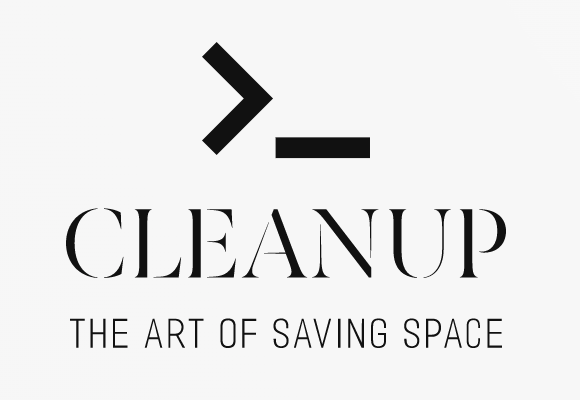

<div align="center">
	

[](https://www.npmjs.com/package/clean-up?activeTab=dependents)
[](https://www.npmjs.com/package/clean-up)
</div>

<div align="center">
    <p>
        You can help to mantain this project with your code or colaborate in the <a href="https://github.com/sponsors/gabamnml">GitHub Sponsors</a> page.
    </p>
</div>

## About

If you are programming and meanwhile you are bored of having to deal with the space occupied by dependencies that you are not currently using in your projects, Cleanup is for you! 
Safely and quickly delete unnecessary files that accumulate while working as a true developer.

<!--- TODO: Upload a gif/video tutorial --->

## Install

```sh
npm install clean-up -g
```

don't forget to add -g param to save as a global package for to be able to use it in any directory.  

## Usage

```sh
cleanup
```

It is very easy and fast to use because it has an interactive console!

## Deleted types of files

node_modules folder, .orig git files after a merge, common system files like .DS_Store .Trashes desktop.ini Thumbs.db

## Contribute

If you need to support more types of files create a new issue or push a PR in this repo with the code

## Maintainers

- [Gabriel Aramburu](https://github.com/gabamnml)
